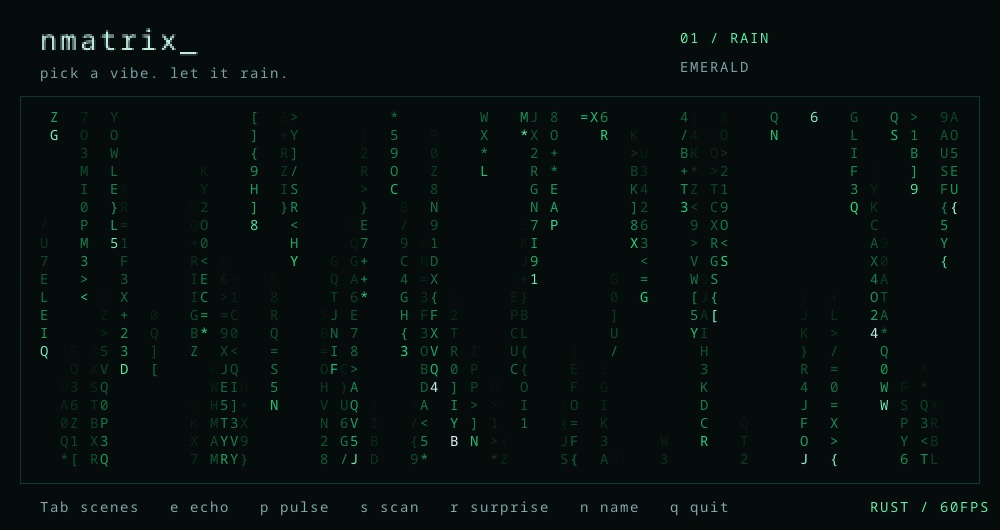
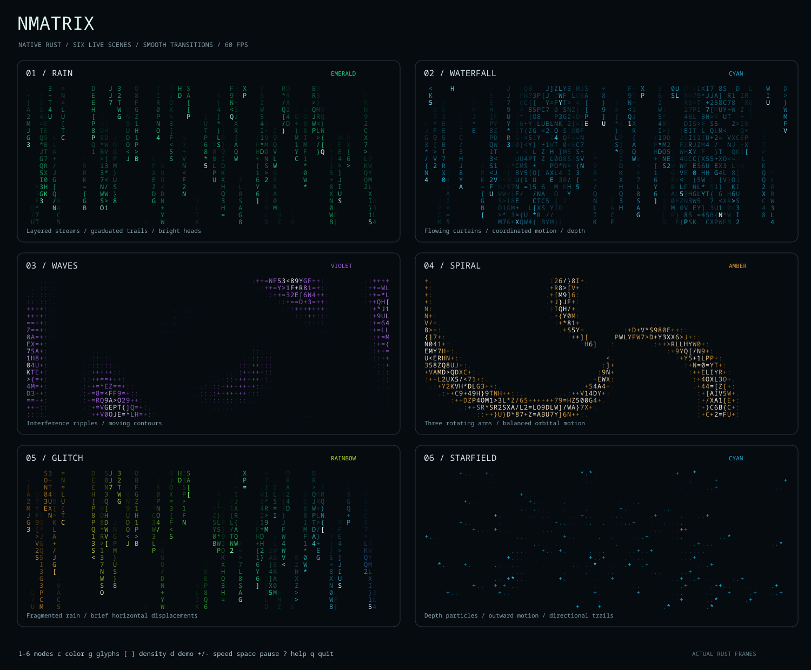

<div align="center">

<h1>nmatrix 🟢</h1>

<p><strong>Pick a vibe. Let it rain.</strong></p>

<p>A little terminal eye candy, built in Rust.</p>

<p><kbd>6 animations</kbd> &nbsp; <kbd>5 palettes</kbd> &nbsp; <kbd>60 FPS</kbd> &nbsp; <kbd>Linux</kbd></p>

[Get started](#get-it-running) · [Pick a scene](#pick-your-vibe) · [Keys](#play-with-it)



</div>

Classic Matrix rain, colorful waves, spinning spirals, and a few other
ways to make your terminal look alive. Pick a vibe and let it run.

## Pick your vibe

🌧️ **Rain** · 🌊 **Waterfall** · 〰️ **Waves** · 🌀 **Spiral** ·
⚡ **Glitch** · ✨ **Starfield**

Five palettes: **emerald, cyan, violet, amber, rainbow**. Smooth scene
transitions, glowing trails, and matrix / binary / hex glyphs.

<details>
<summary>See all six scenes at a glance</summary>



</details>

```bash
nmatrix
nmatrix --demo --palette rainbow
nmatrix --mode spiral --palette violet
nmatrix --mode rain --glyphs binary --density 0.9
```

## Get it running

You'll need Linux and Rust installed. From this folder:

```bash
git clone https://github.com/zackmsa777-a11y/nmatrix.git
cd nmatrix
cargo build --release --locked
install -Dm755 target/release/nmatrix ~/.local/bin/nmatrix
nmatrix
```

Make sure `~/.local/bin` is in your PATH. You can also try it directly:

```bash
cargo run --release -- --demo --palette rainbow
```

## Play with it

| Key | What it does |
| --- | --- |
| `1`–`6`, left/right | Pick an animation |
| `c` | Change colors |
| `g` | Change glyphs |
| `[` / `]` | Less / more density |
| `+` / `-`, up/down | Faster / slower |
| Space | Pause |
| `d` | Auto-cycle scenes and colors |
| `h` | Hide the bottom bar |
| `?` | Show help |
| `q`, Escape, Ctrl+C | Quit |

Starts at 60 FPS. Demo changes scenes every 12 active seconds.
Use `nmatrix --help` for all the options.

## Tinker

```bash
cargo test --locked
```

20 tests cover the scenes, controls, resizing, and terminal cleanup.
Only one dependency: `libc`. No Python needed.

MIT licensed. Have fun with it.
