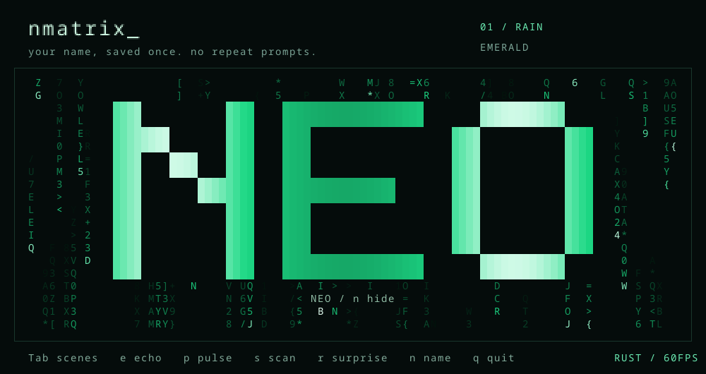

<div align="center">

<h1>nmatrix 🟢</h1>

<p><strong>Pick a vibe. Let it rain.</strong></p>

<p>A little terminal eye candy, built in Rust.</p>

<p><kbd>12 animations</kbd> &nbsp; <kbd>8 palettes</kbd> &nbsp; <kbd>Your name in lights</kbd> &nbsp; <kbd>Rust / Linux</kbd></p>

[Get started](#get-it-running) · [Pick a scene](#pick-your-vibe) · [Keys](#play-with-it)


</div>

Classic Matrix rain, black holes, spiral galaxies, northern lights,
fireworks, and more. Pick a vibe and make the terminal yours.

## Pick your vibe

🌧️ **Rain** · 🌊 **Waterfall** · 〰️ **Waves** · 🌀 **Spiral** ·
⚡ **Glitch** · ✨ **Starfield** · 🕳️ **Black hole** · 🌌 **Galaxy** ·
🌈 **Aurora** · 🫧 **Plasma** · 🚀 **Tunnel** · 🎆 **Fireworks**

Eight palettes: **emerald, cyan, violet, amber, rainbow, rose, ice, sunset**.
Smooth transitions, glowing trails, and matrix / binary / hex glyphs.

<details>
<summary>See all twelve scenes at a glance</summary>


</details>

```bash
nmatrix
nmatrix --demo --palette rainbow
nmatrix --mode spiral --palette violet
nmatrix --mode rain --glyphs binary --density 0.9
nmatrix --mode blackhole --palette amber --echo
nmatrix --mode galaxy --palette violet --pulse
nmatrix --mode aurora --palette sunset
```

## Your name, your terminal

The first time you run `nmatrix`, type your name and press Enter. It appears
in glowing block letters over the animation and is remembered next time.
Unicode names work too; small windows use normal text so the name fits.



Press `n` to hide or show it. To change the saved name:

```bash
nmatrix --name "Neo"
```

Just want the animation? `nmatrix --no-name` skips the prompt and banner.
The name lives in `~/.config/nmatrix/config` (or your `XDG_CONFIG_HOME`).

## Make it your vibe

Press `e` for echo trails, `p` for a brightness pulse, or `s` for scanlines.
They stack, so try a few together. Press `r` for a surprise scene and palette.
Tab opens the scene picker; arrows choose and Enter starts it.

```bash
nmatrix --mode tunnel --palette ice --echo --scanlines
nmatrix --mode fireworks --palette rainbow --pulse
```

## Get it running

You'll need Linux and Rust installed. From this folder:

```bash
git clone https://github.com/zackmsa777-a11y/nmatrix.git
cd nmatrix
cargo build --release --locked
install -Dm755 target/release/nmatrix ~/.local/bin/nmatrix
nmatrix
```

Make sure `~/.local/bin` is in your PATH. You can also try it directly:

```bash
cargo run --release -- --demo --palette rainbow
```

## Play with it

| Key | What it does |
| --- | --- |
| Tab, up/down, Enter | Open the picker, choose, and play |
| `1`–`9`, `0` | Quick-select the first ten scenes |
| Left/right, `m` | Cycle all twelve scenes |
| `c` | Change colors |
| `g` | Change glyphs |
| `e` / `p` / `s` | Echo trails / pulse / scanlines |
| `r` | Surprise scene and palette |
| `n` | Hide / show your name |
| `[` / `]` | Less / more density |
| `+` / `-`, up/down | Faster / slower |
| Space | Pause |
| `d` | Auto-cycle scenes and colors |
| `h` | Hide the bottom bar |
| `?` | Show help |
| `q`, Escape, Ctrl+C | Quit |

Starts at 60 FPS. Demo changes scenes every 12 active seconds.
Use `nmatrix --help` for all the options.

## Tinker

```bash
cargo test --locked
```

Tests cover the scenes, controls, saved names, resizing, and terminal cleanup.
Only one dependency: `libc`. No Python needed.

MIT licensed. Have fun with it.
